# 小于印染服装展示平台

本项目包含三端：

- `server/`：Spring Boot 3 + MyBatis Plus 后端。
- `admin/`：Vue 3 + Vite + Element Plus 后台管理系统。
- `miniprogram/`：原生微信小程序。

## 配置说明

后端使用 Spring Profile 区分本地和上线环境：

- `local`：读取 `server/src/main/resources/application-local.yml`
- `prod`：读取 `server/src/main/resources/application-prod.yml`

真实配置文件包含数据库密码、JWT 密钥等敏感信息，不提交到 Git。仓库只保留示例文件：

```text
server/src/main/resources/application-local.example.yml
server/src/main/resources/application-prod.example.yml
docker-compose.local.example.yml
```

首次拉取项目后，复制示例文件并填入自己的真实配置：

```powershell
Copy-Item server\src\main\resources\application-local.example.yml server\src\main\resources\application-local.yml
Copy-Item server\src\main\resources\application-prod.example.yml server\src\main\resources\application-prod.yml
Copy-Item docker-compose.local.example.yml docker-compose.local.yml
```

## 本地开发

本地链路：

```text
小程序 / 后台 -> 本地 Spring Boot -> 本地 MySQL -> 本地 uploads
```

启动后端：

```powershell
cd D:\code\fzxcx
.\scripts\start-local-server.ps1
```

验证：

```text
http://127.0.0.1:8080/actuator/health
```

默认后台账号：

```text
admin / admin123
```

启动后台：

```powershell
cd D:\code\fzxcx
.\scripts\start-local-admin.ps1
```

访问：

```text
http://127.0.0.1:5173
```

小程序用微信开发者工具导入：

```text
D:\code\fzxcx\miniprogram
```

开发者工具本地调试时，如请求本地后端，请勾选：

```text
详情 -> 本地设置 -> 不校验合法域名、web-view、TLS 版本以及 HTTPS 证书
```

## 上线提醒

- 后端部署到微信云托管服务 `xiaoyu-yinran-server`。
- Dockerfile 默认使用 `prod` profile。
- 上线前确认 `server/src/main/resources/application-prod.yml` 已在部署环境中配置好真实数据库和对象存储访问地址。
- 上线前把 `miniprogram/utils/config.js` 的 `mode` 改为 `cloud`。

## 小程序页面预览

| 预览 | 预览 |
| --- | --- |
| 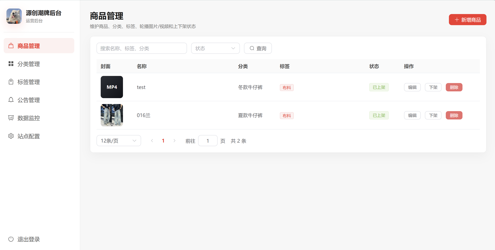 | 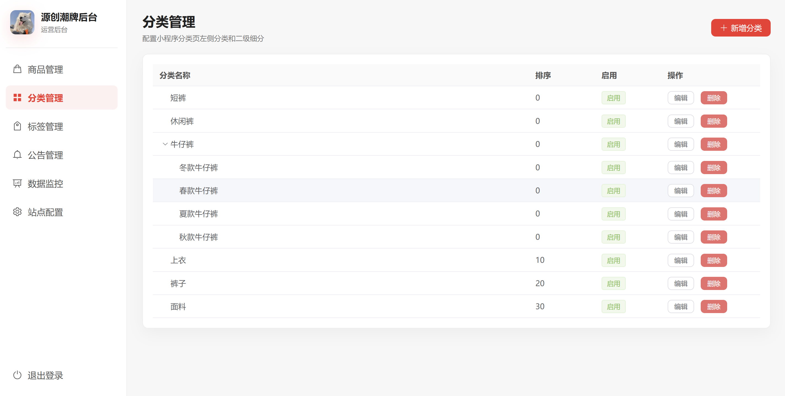 |
| 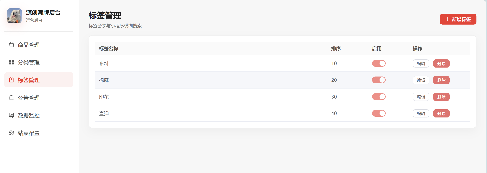 | 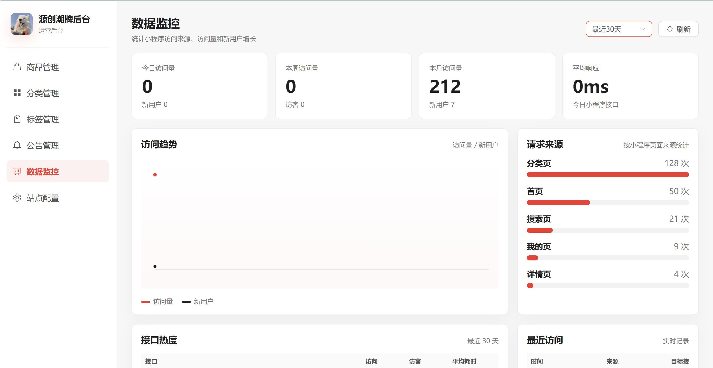 |
| 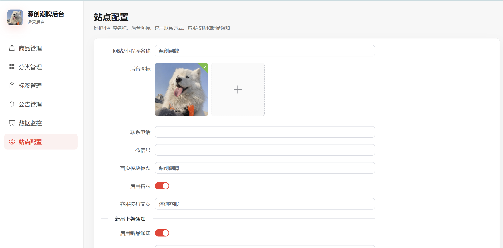 | 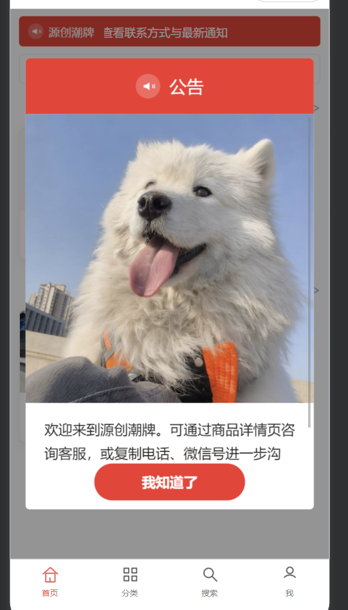 |
| 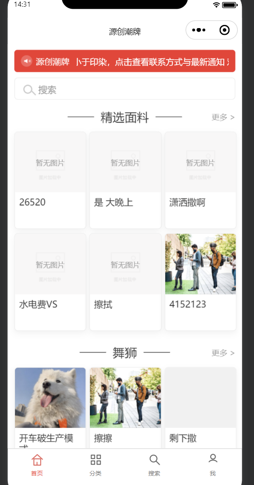 | 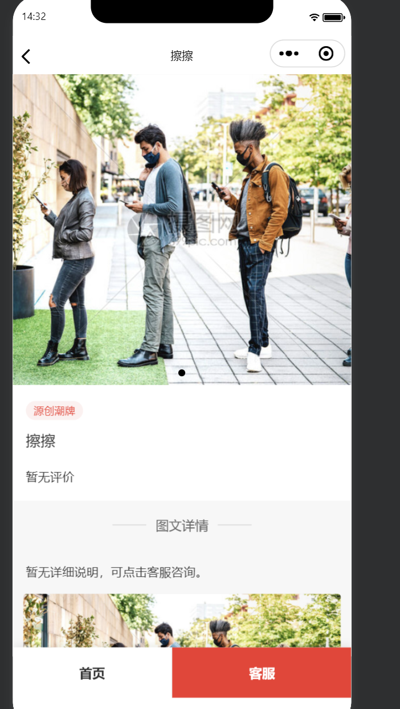 |
| 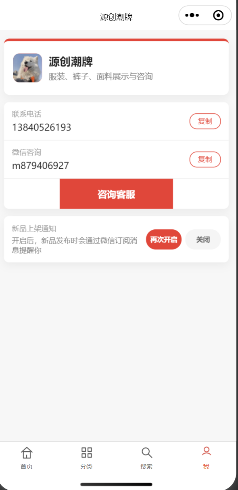 | 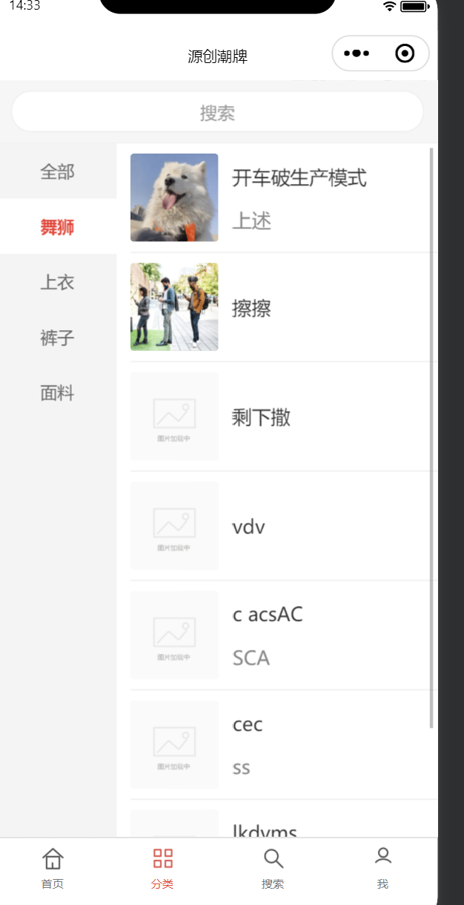 |
| 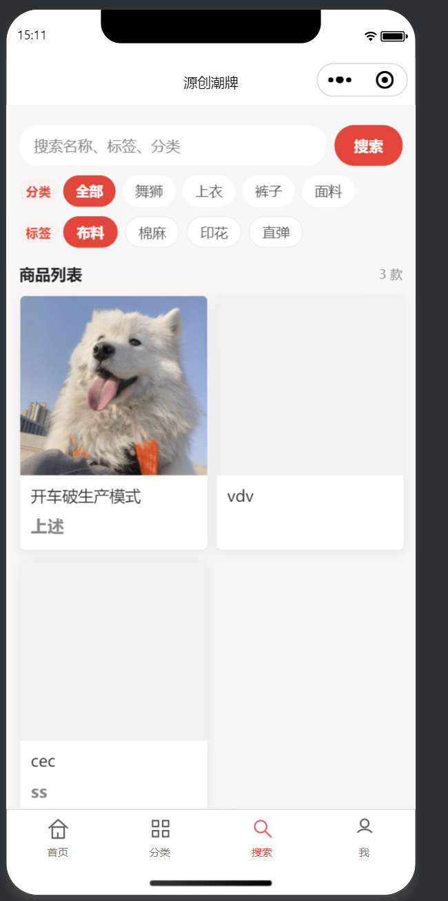 |  |
